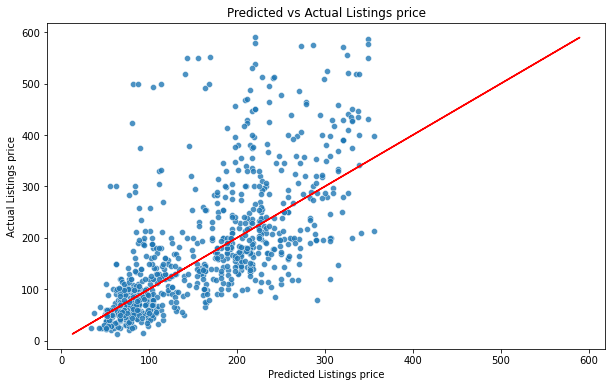

# Airbnb price recommender and Web application for Homeowners 

## Background

Airbnb is an online marketplace that connects people who want to rent out their homes with people who are looking for accommodations in specific locales. It offers homeowners an easy, relatively stress-free way to earn some income from their property and guests 
often find Airbnb is cheaper, has more character, and is homier than hotels. Airbnb makes the bulk of its revenue by charging a service fee for each booking.

### Background and Problem Statement

With the Covid-19 pandemic over and travellers coming back to Singapore, there is an increased demand for short-term accommodation which Airbnb owners can capitalise and rent out their property for revenue.  
One problem that new Airbnb owners have is on how to optimally price their property to maximise the occupancy and revenue amount. Although Airbnb provide guides on how to price the listings, 
there are currently no free services where users can generate an estimated pricing based on the features of the property. One method that homeowners can price their property is by pricing it similarly to the listings around the area however
an issue with this method is that the homeowners might miss out on potential revenue due to their property having unique or better amenities and features. 

To tackle this problem, a web application will be created that generates an estimated pricing when users key in their listing information. In order to create this application, supervised machine learning regression models 
were trained to predict listing prices. The regression model will be assessed by their R2 Score, RMSE and the generalisation of the model in which the best performing model will be used for the web application. 
Besides providing an estimate for the user, the project identifies and provide insights on the features and amenities impact on property prices providing information to users on how to improve their listings to increase their revenue. 
 
## Datasets
The dataset used for this project was sourced from [InsideAirbnb.com](http://insideairbnb.com/get-the-data), a mission driven project that provides data and advocacy about Airbnb's impact on residential communities by scraping and reporting data on Airbnb listings.

The dataset was last scraped on 22 September 2022 and contains information of all the Airbnb listings on that particular day. 

The dataset comprises of the following:
- `Listings`: Detailed listings data of 75 attributes for each of the listings. The data dictionary is shown below for the relevant attributes
- `Calendar`: Detailed calendar data showing listings availability, dates, prices (adjusted, minimum, maximum)
- `Reviews`: Detailed reviews for Listings showing reviewer, comments
- `Neighbourhoods`: GeoJSON file of the different neighbourhoods in Singapore

The data dictionary of the dataset can be found [here](https://docs.google.com/spreadsheets/d/1iWCNJcSutYqpULSQHlNyGInUvHg2BoUGoNRIGa6Szc4/edit#gid=1322284596)

##	Exploratory Data Analysis

The Airbnb listings in Singapore are made up of 80% apartment, 16% of Hotel and House which contribute a small 4% of the total listings. The apartment listings are scattered throughout the island while the hotels are centered around the CBD area and Southern Waterfront area.

 
 
 The listings in Marina South fetch the highest price among the neighbourhoods at about $600 per night 
while most listings are about $150-$200 per night. 

As for the features, listing prices generally increases with number of guests and beds, and having a sharp drop when accommodation capacity exceed 9 pax. This is due to the fact that those listings are hostels with high capacity and low prices.

## Preprocessing & Feature Engineering

Preprocessing & Feature engineering was also performed on the dataset to create additional features to be used for supervised machine learning. 

One feature engineering performed was to group the amenities for the listings into categories and select influential amenities to determine their effect on listing price.
In general, consumers expect amenities such as TV, Air conditioning and Wifi to be available, prices tend to be lower when owners do not provide these amenities.

Next, word count of the listing and description was calculated as Airbnb owners tend to provide renters with important information such as location, amenities and no. of rooms of their listings in their title and description to increase the clickrates and booking of their listings. 

Similarly to the housing market, proximity to MRT stations and City centre were calculated via haversine formula.

## Regression model Evaluation/Metrics

|                Model | R2 (Train) | R2 (Test) | RMSE (Train) | RMSE (Test) | Generalisation |
|---------------------:|-----------:|----------:|-------------:|------------:|:--------------:|
| K-Nearest Neighbours |        1.0 |     0.678 |          0.0 |      76.074 | 32.20%         |
|        Random Forest |      0.897 |     0.723 |       52.944 |      74.553 | 19.40%         |
|            Light GBM |      0.958 |     0.767 |       35.306 |      69.126 | 19.94%         |
|              XGBoost |      0.762 |     0.696 |       80.179 |      81.432 | 8.66%          |

The regression models were evaluated based on the following metrics:
R2 Score - Higher value indicates how much the model can explain the variance in the listing prices
RMSE - Average deviation between the predicted and actual price
Generalisation score - Higher value indicates the model show signs of overfitting to the data and inability to adapt and react to unseen data 

Based on the above criteria, XGBoost was selected as the best performing model due to its much lower generalisation score compared to the other models. 
Therefore XGBoost will be used for the final production model. 

## Production model Evaluation

The XGBoost production model will be compared with the original full featured XGBoost model to compare their performance difference.

|                   Model | R2 (Train) | R2 (Test) | RMSE (Train) | RMSE (Test) | Generalisation |
|------------------------:|-----------:|----------:|-------------:|------------:|:--------------:|
| XGBoost (Full features) |      0.754 |     0.693 |       81.684 |      82.081| 8.09%         |
|    XGBoost (Production) |      0.669 |     0.611 |       93.024 |      91.817 | 8.67%        |

A comparison table of the models is shown in the table above. 

There is a slight drop in the R2 values and an increase in generalisation score from 8.67% to 10.87%.
The model is also only able to explain about 61.5% of the variation in the listing prices with an RMSE price of $91.80 on the test data.

Comparing the full feature and production models, the full feature model perform fairly wells with majority of the predicted scatter points falling close to the diagonal line (representing perfect prediction) 
for listings below $250 as compared to listings below $120 for the production model. The models also tend to underpredict the prices for listings above $250 and $120 respectively and performed poorly for listings above $300 
with the predicted prices being significantly lower than the actual prices.

On average, the full feature model predict listings within $14.8 of the actual price (or about 11.4%) for 70% of the listings while the production model is only able to predict listings within $16.60 of the actual price (or about 13.5%) for 60% of the listings.

## Feature importance with SHAP

It is not enough to just create a regression model but to also interpret the machine learning model and derive insights on the impacts of the features on the model prediction. This can be done using SHAP values which was first proposed by [Lundberg and Lee](https://shap.readthedocs.io/en/latest/index.html) 
as a unified approach to explain the output of any machine learning model.

The benefits of using SHAP values are that 
1) Global interpretability - It can be used to summarize the impact of each features on the overall model.
2) Local interpretability - It can be used to explain the prediction for a single observation as each observation gets its own SHAP values, allowing us to identify the features that contributed to the prediction.
3) SHAP values can be calculated for any tree-based models

**Global interpretability**

To get an overview of which features are important for the model, we can plot a bar plot of the SHAP values for the features in descending order to determine the importance of the features.

**Local interpretability**

Besides using SHAP to get an overview, we can also use it to understand how each features impact the predicted price of each listing by creating a waterfall plot to show how the model derived the final pricing based on the various features.

**E[f(x)]**: is the output value of the model's prediction for the given input. \
 **f(x)**: is the base value for the given input. It is the price that will be predicted if we did not know any features for the current output. \
**Red bars**: Features that push the listing price ***higher*** \
**Blue bars**: Features that pull the listing price ***lower*** \
**Width of bars**: Importance of the feature. The wider it is, the higher impact is has on the price \
**Values**: The logarithmn value of the features, base inputs and output. To get the value ofhow much the feature affect the price of the listing in $, take the exponential of the value

## Price recommender Web App deployment

The XGBoost model was deployed onto a web app using Streamlit. The app allows users to input their Airbnb features into the app to get a predicted listing price. It shows the map of Singapore, with the location of their listing.
In addition, it also displays a Waterfall chart showing users how the model derived the final predicted pricing from the input features and how they increase or decrease the price.

## Conclusion and Recommendations

In this project, XGBoost was selected as the final production model for the Price recommender app due to its much low generalisation score compared to other models. The SHAP plot shows that `accommodates`, `Room type`, `Bathroom type` and `bedrooms` are the top features
driving the price of an Airbnb listings. For the production model, amenities was not being used as the feature for the models and this can be included in the future which might improve the model performance further. 

**Recommendations**: \
Use a more accurate price data as the listing price used is set by the owner and not the actual price paid by the consumers \
Improve the dataset by incorporating other features such as property size, unit level and proximity features to F&B and attractions \
Remove hostels from the data as it has a high number of bedrooms/beds with low listing price, this affects the model performance \
Incorporate the Airbnb amenities as features for the production model and web application 

